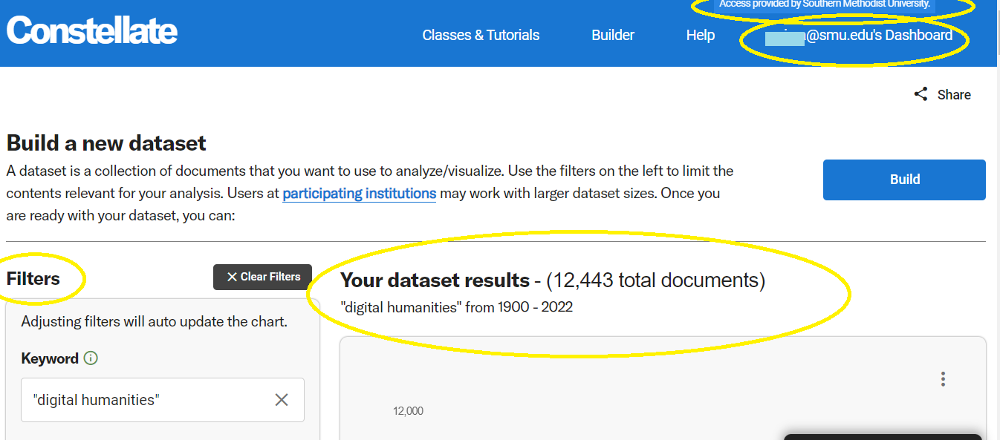
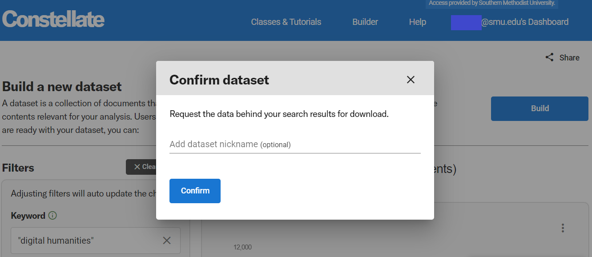
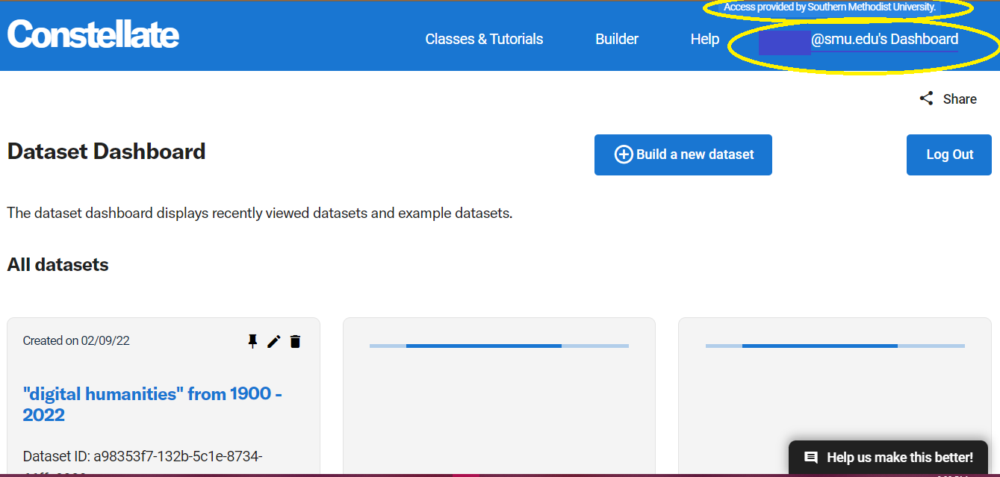
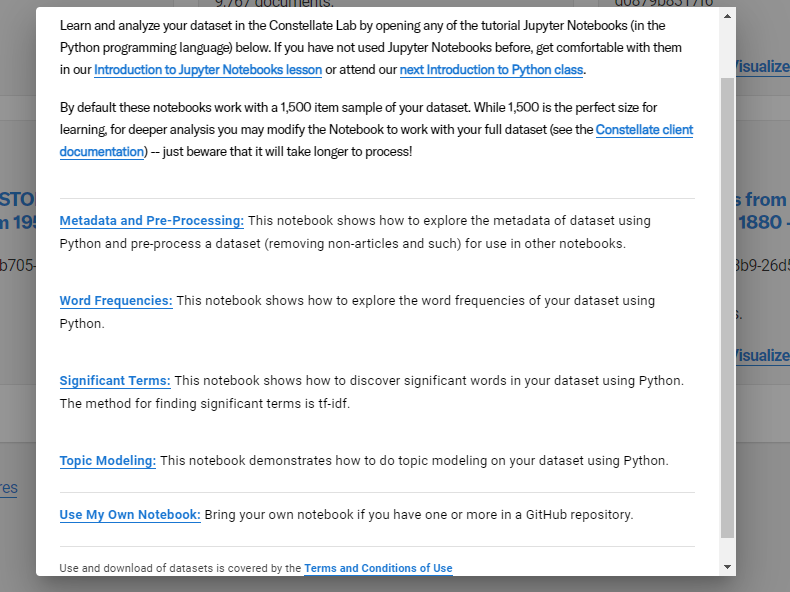

# JSTOR Constellate

* [Quickstart](https://constellate.org/news/user-quick-start)
* [What is Constellate?](https://constellate.org/docs/what-is-constellate/)
* [Constellate](https://labs.jstor.org/projects/text-mining/) is text analytics platform from ITHAKA. 
  
  * *teach and learn* text analytics
    * [Constellate tutorials](https://constellate.org/tutorials/)
    * *build datasets* from across multiple content sources
     * Two of ITHAKA’s services, JSTOR and Portico, are the initial sources of content for the new platform, which includes: [Chronicling America, collections from Documenting the American South, the South Asia Open Archives and Independent Voices from Reveal Digital.](https://constellate.org/docs/data-sources/)  
    * [Build a new dataset](https://constellate.org/builder/)  
    * [Dataset Dashboard and Example datasets](https://constellate.org/dataset/dashboard/)
        * Saving to Dashboard and examples available when logged in. 
    * *visualize and analyze* their datasets.
     * [Working with Dataset Files](https://constellate.org/tutorials/working-with-dataset-files)

# Login to JSTOR & CONSTELLATE    
* 1st: Login into JSTOR & Constellate. [Directions are on this guide](https://guides.smu.edu/jstordfr). 

* Enter your keywords in *Build your dataset* and search. It will then run your search. You can use filters to refine and modify your search.

* Once your results look interesting to you, click on *Build* your dataset. It will ask if you want to name your dataset.

* You will then be at your *Dataset Dashboard* which displays recently viewed datasets and example datasets.

* Scroll down to see the example datasets. 

* **The options available to you are:** 

* **Analyze**: This will allow you to analyze your dataset in the Constellate Lab by opening any of the tutorial Jupyter Notebooks (in the Python programming language) as seen below.

* **Visualize**: This will allow you to do things like visualize terms across your dataset.

* **Download**: note the options available in regards to content (metadata, ngrams, full-text, sampled metadata, trigrams) and formats (.csv, json)
* There is a limit on how large a dataset you can download. 
  * More on [Working with Dataset Files](https://constellate.org/tutorials/working-with-dataset-files)

