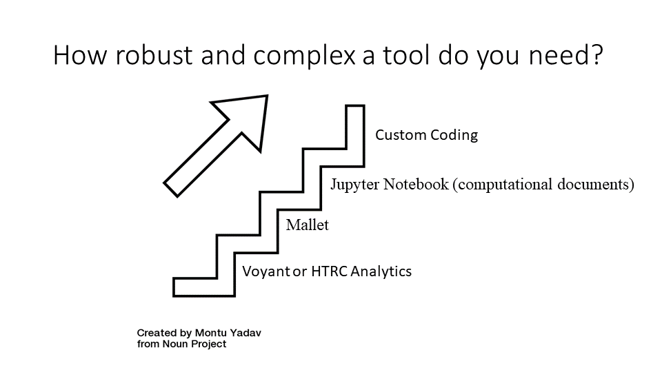

# TDM tools 
* For performing text analysis, there are both pre-built tools and do-it-yourself tools that you can choose from. 

## Pre-built
* The benefits of pre-built tools are they are usually easy to use, they don’t require too much technical knowledge, and they can be very useful in teaching.

* The main drawback of pre-built tools is because they have predefined functions, they offer less control to the researcher and limit what a user can accomplish.

* [Voyant](https://voyant-tools.org/), [Lexos](https://wheatoncollege.edu/academics/special-projects-initiatives/lexomics/lexos-installers/), and [HTRC algorithms](https://analytics.hathitrust.org/algorithms) are examples of pre-built tools. The HTRC Topic Modeling algorithm, which identifies “topics” in a set of text based on words that have a high probability of occurring close together, is a representative HTRC algorithm that can be used for exploratory analysis. 

* Choosing a pre-built tool is based on the goal of the analysis. Each pre-built tool has its own strengths, outputs, and weaknesses. 
* For quick analysis and visualizations, Voyant and Lexos are all excellent choices. They don’t allow much parameterization, but they are very easy to use. To make concordances(seeing key words in context), AntConc or Voyant are tools programmed to do that. Voyant is both web-based and downloadable, so there no installation required unless desired by the researcher, while AntConc is software the user must install on their computer.
* [Weka](https://waikato.github.io/weka-wiki/) is the tool to use for researchers who want to try machine learning with a tool that has a visual front-end. It also needs to be installed.

## Do it yourself tools & toolkits
* You can also use do-it-yourself tools for text analysis as an alternative, and these tools usually involve some degree of programming.
* The advantages of using do-it-yourself tools are you can set your own workflows and parameters, and it allows you to have more control over what you want to do.
* The drawback is they usually require technical knowledge and may be a lot harder to use. 
* [Mallet: MAchine Learning for LanguagE Toolkit](https://mimno.github.io/Mallet/index)

# Coding
* Writing your own script allows you the most amount of control

* Python is a commonly-used programming language, and it’s very useful for working with data. 
    * It is also an [interpreted language, which basically means it follows step-by-step directions.](https://www.freecodecamp.org/news/compiled-versus-interpreted-languages/) 
    * Additionally, Python is generally easy to learn with its relatively simple syntax. For example, one of its learner-friendly features is it avoids excess punctuation. 

-----

Some content in this session based on [HTRC Digging Deeper, Reaching Further](https://teach.htrc.illinois.edu/teaching-materials/) used under a [Creative Commons Attribution-NonCommercial 4.0 International License.](https://creativecommons.org/licenses/by-nc/4.0/)

